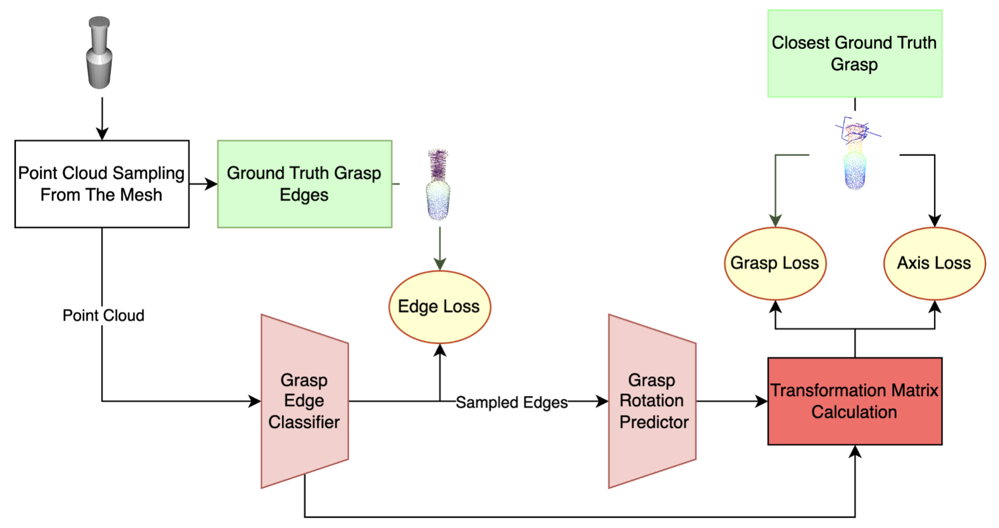
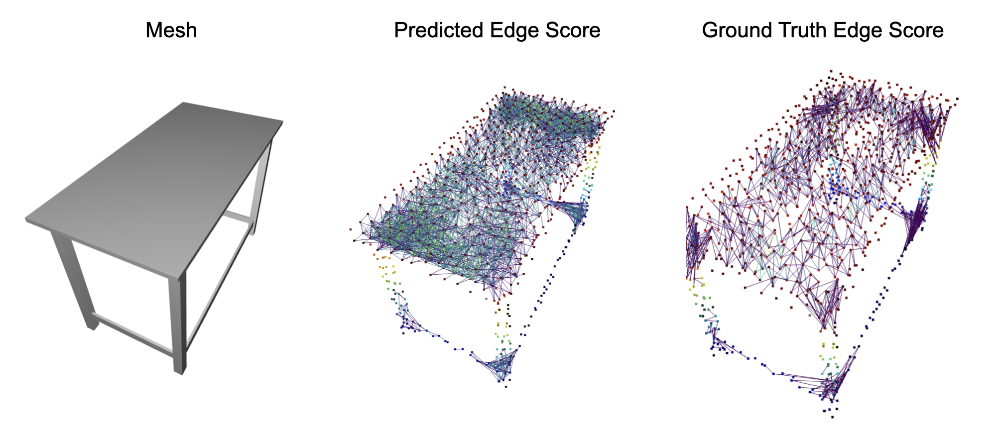
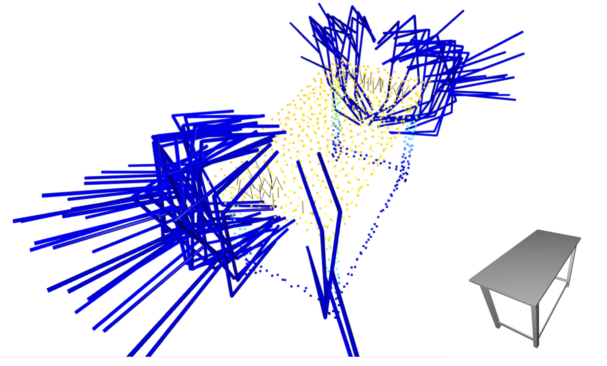

# Grasp Everything With Anything

Predicting stable grasps is a crucial aspect of robotic manipulation tasks, yet universal object grasping remains challenging due to variations in gripper designs, occlusions, and potential object collisions. To address the SE(3) grasp prediction problem, we introduce PointPairNet, a novel approach that leverages object geometry and gripper contact points. PointPairNet processes full 3D point clouds of objects to select touch-point pairs and grasp poses inferred from the edge features of the pair. We tested multiple methods for deriving grasp estimates and found that using edge features achieves a 78% success rate in grasp pose estimation opposed to a point-level method achieving 72% success rate. Our results demonstrate the effectiveness of PointPairNet in generating reliable grasp predictions for diverse objects.

In this repository, we implemented 3 methods for object grasping using point clouds. PointPairNet, ApproachNet and EdgeGraspNet:

1) PointPairNet<b/>
PointPairNet is a method that we developed. It classifies graspable edges between the point pairs on the point cloud. It uses the edge embedding to predict grasp poses for different objects.



Example graspable edges:


Predicted grasps:


2) ApproachNet<b/>
ApproachNet is a model based on classifying valid approach points on the point cloud and using the embeddings of the approach points to predict grasp poses. This model is similar to the [Contact-GraspNet](https://arxiv.org/abs/2103.14127)

3) EdgeGraspNetwork<b/>
We implemented [Edge Grasp Network paper](https://arxiv.org/abs/2211.00191) and compared results our results with it.

## Installation
```[bash]
cd GEWA
conda create -n GEWA python=3.11
conda activate GEWA
```
Install conda for your device: https://pytorch.org/get-started/locally/

```
conda install pyg -c pyg
pip install -r requirements.txt
```

## Dataset
-Download the Acronym and ShapeNet datasets and unzip to the data folder
https://sites.google.com/view/graspdataset <b/>
https://huggingface.co/datasets/ShapeNet/ShapeNetSem-archive

-Clone the Manifold repository https://github.com/hjwdzh/Manifold to the root directory and follow the instructions in the repo to build the Manifold package

-Make the downloaded meshes watertight using Manifold with the following command:
```
python dataset/preprocess_shapenet.py
```
-After the preprocessing, the data folder should look like this:
```
data/
├── splits
├── acronym
├── ShapeNetSem-backup
├── simplified_obj
```

The split folder contains the training and testing splits used in the ContactNet paper.

Run the following command to generate the Touch Point Pair (TPP) or Approach dataset:
```
python dataset/create_tpp_dataset.py
```
```
python dataset/create_approach_dataset.py
```

Created datasets can be visualized with the following commands. Press q to iterate in the dataset:

Visualize TppDataset: mesh, edge / grasp pairs and all graspable edges of the point cloud. Press q to iterate in the dataset:
```
python utils/visualize_tpp_dataset.py
```

Visualize ApproachNet: Valid approach points and grasps for some of these points:
```
python utils/visualize_approach_dataset.py
```

Visualize the watertightened and simplified meshes (red) compared to the original meshes (blue) as well as point clouds sampled from the meshes:
```
python utils/visualize_watertight.py 
```

## Inference
Give the index of the test objects by --sample_idx.

### PointPairNet
```
python test_tppnet.py --sample_idx 0
```

### Approachnet
```
python test_approachnet.py --sample_idx 0
```

## Training

### PointPairNet

### Approachnet

### EdgeGraspNet
